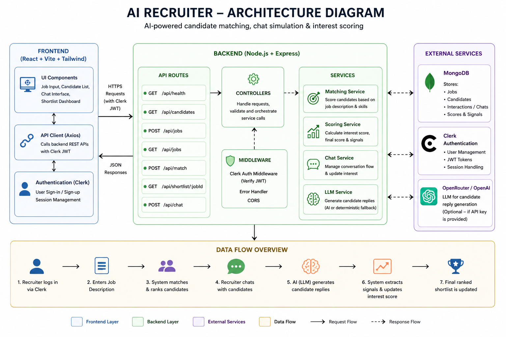

# AI Recruiter
An AI-powered recruiter assistant that matches candidates to job descriptions, simulates recruiter conversations, and dynamically ranks candidates based on both skill fit and conversational interest signals.

A simple production-ready full-stack recruiter assistant:

## 🛠 Tech Stack

- Frontend: React, Vite, Tailwind CSS
- Backend: Node.js, Express
- Database: MongoDB
- Authentication: Clerk
- AI: OpenRouter / OpenAI (with fallback)

  ## Architecture



## ⚙️ How It Works

1. Recruiter inputs a job description
2. System ranks candidates based on skill match
3. Recruiter initiates chat with candidates
4. AI simulates candidate responses
5. System extracts signals from conversation:
   - Intent
   - Salary expectations
   - Availability
   - Location preference
6. Interest score is updated dynamically
7. Final ranking adjusts based on match + interest

## Folder Structure

```txt
ai-recruiter/
  client/
    src/
      components/
      lib/
      App.jsx
      main.jsx
      index.css
    .env.example
    package.json
    vite.config.js
    tailwind.config.js
    postcss.config.js
  server/
    src/
      config/
      data/
      middleware/
      models/
      routes/
      services/
      app.js
      index.js
    .env.example
    package.json
  package.json
  README.md
```

## Setup

1. Install dependencies:

```bash
npm install
```

2. Create environment files:

```bash
cp client/.env.example client/.env
cp server/.env.example server/.env
```

3. Fill in Clerk and MongoDB values:

Client:

```env
VITE_CLERK_PUBLISHABLE_KEY=pk_test_your_key
VITE_API_URL=http://localhost:5000/api
```

Server:

```env
PORT=5000
CLIENT_ORIGIN=http://localhost:5173
MONGODB_URI=mongodb://127.0.0.1:27017/ai-recruiter
CLERK_PUBLISHABLE_KEY=pk_test_your_key
CLERK_SECRET_KEY=sk_test_your_key
OPENROUTER_API_KEY=your_key_here
```

During local development, the server also falls back to `client/.env`'s `VITE_CLERK_PUBLISHABLE_KEY`, but setting `CLERK_PUBLISHABLE_KEY` in `server/.env` is recommended.

`OPENROUTER_API_KEY` is optional. Without it, the chat uses a deterministic local simulation so the app still works.

4. Run MongoDB locally or use MongoDB Atlas.

5. Start the app:

```bash
npm run dev
```

Frontend: `http://localhost:5173`

Backend: `http://localhost:5000`

## API

All recruiter APIs are protected by Clerk auth. Send `Authorization: Bearer <Clerk session token>`.

- `GET /api/health` - server health
- `GET /api/candidates` - mock candidates
- `POST /api/jobs` - save a job description
- `GET /api/jobs` - list recruiter jobs
- `POST /api/match` - rank candidates against a job description
- `GET /api/shortlist/:jobId` - fetch final ranked shortlist for a job
- `POST /api/chat` - simulate recruiter-candidate chat and update interest score

## 🧪 Sample Input

### Job Description
Senior Frontend Engineer

We are looking for a React developer with strong experience in:

TypeScript
API integration
Performance optimization
Unit testing

Bonus:

Node.js experience
Experience with hiring platforms

  ### Example Chat Response

```json
{
  "reply": "I’m targeting around 12 LPA...",
  "interestScore": 72,
  "finalScore": 81,
  "signals": {
    "intent": 90,
    "salaryFit": 70,
    "availability": 60,
    "locationFit": 80
  }
}

## Production Notes

- Use Clerk JWTs between frontend and backend.
- Set `CLIENT_ORIGIN` to the deployed frontend URL.
- Use MongoDB Atlas with IP allowlisting.
- Keep `CLERK_SECRET_KEY` and `OPENAI_API_KEY` only on the server.
- Replace mock candidates with a real `Candidate` collection when ready.
